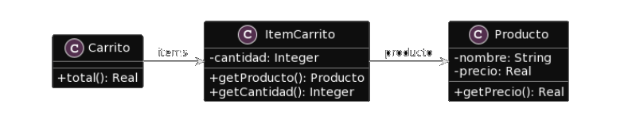

# 2.3 Publicacion
**Consigna:** Para el siguiente codigo, realice en forma iterativa los siguientes pasos:
1. indique el mal olor,
2. indique el refactoring que lo corrige, 
3. aplique el refactoring, mostrando el resultado final (código y/o diseño según corresponda). 

Si vuelve a encontrar un mal olor, retorne al paso 1.

**UML Proporcionado**



**Codigo Proporcionado**
``` java
public class Producto {
    private String nombre;
    private double precio;
    
    public double getPrecio() {
        return this.precio;
    }
}

public class ItemCarrito {
    private Producto producto;
    private int cantidad;
        
    public Producto getProducto() {
        return this.producto;
    }
    
    public int getCantidad() {
        return this.cantidad;
    }

}

public class Carrito {
    private List<ItemCarrito> items;
    
    public double total() {
        return this.items.stream().mapToDouble(item -> item.getProducto().getPrecio() * item.getCantidad()).sum();
    }
}
```
---
## Solucion:
<br>

**Code Smell:** Nombre de metodo poco descriptivo.

**Refactoring:** Utilizaremos la tecnica de Rename methods.
   1. Vea si el método está definido en una superclase o subclase. Si es así, también debe repetir todos los pasos en estas clases.
   2. El siguiente método es importante para mantener la funcionalidad del programa durante el proceso de refactorización. Cree un nuevo método con un nuevo nombre. Copie el código del método anterior. Elimine todo el código del método anterior y, en su lugar, inserte una llamada para el nuevo método.
   3. Encuentre todas las referencias al método anterior y reemplácelas con referencias al nuevo.
   4. Eliminar el método antiguo. Si el método anterior es parte de una interfaz pública, no realice este paso. En su lugar, marque el método antiguo como obsoleto.

``` java
public class Producto {
    private String nombre;
    private double precio;
    
    public double getPrecio() {
        return this.precio;
    }
}

public class ItemCarrito {
    private Producto producto;
    private int cantidad;
        
    public Producto getProducto() {
        return this.producto;
    }
    
    public int getCantidad() {
        return this.cantidad;
    }

}

public class Carrito {
    private List<ItemCarrito> items;
    
    public double precioTotalDeLaCompra() {
        return this.items.stream().mapToDouble(item -> item.getProducto().getPrecio() * item.getCantidad()).sum();
    }
}

```
**Code Smell:** El metodo "total" peca de envidia de atributos.

**Refactoring:** Se puede aplicar la tecnica de **Move Methods**.
   1. Si claramente se debe mover un método a otro lugar, use Move Method.
   2. Si solo una parte de un método accede a los datos de otro objeto, use Extraer método para mover la parte en cuestión.
   3. Si un método usa funciones de varias otras clases, primero determine qué clase contiene la mayoría de los datos usados. Luego coloque el método en esta clase junto con los otros datos. De manera alternativa, use Extraer método para dividir el método en varias partes que se pueden colocar en diferentes lugares en diferentes clases.

``` java
public class Producto {
    private String nombre;
    private double precio;
    
    public double getPrecio() {
        return this.precio;
    }
}

public class ItemCarrito {
    private Producto producto;
    private int cantidad;
        
    public Producto getProducto() {
        return this.producto;
    }
    
    public int getCantidad() {
        return this.cantidad;
    }

    public double getPrecioTotal(){
        return this.getCantidad() * this.getProducto().getprecio();
    } 

}

public class Carrito {
    private List<ItemCarrito> items;
    
    public double precioTotalDeLaCompra() {
        return this.items.stream().mapToDouble(item -> item.getPrecioTotal()).sum();
    }
}
```
---

## Dudas: 
No se si seria correcto la colocacion de un Constructor ya que parece faltar, pero no se que tecnica de refactoring seria esa.

```java
public class Producto {
    private String nombre;
    private double precio;
    
    public Producto(String nombre, double precio){
        this.nombre = nombre;
        this.precio = precio;
    }

    public double getPrecio() {
        return this.precio;
    }
}

public class ItemCarrito {
    private Producto producto;
    private int cantidad;
    
    public ItemCarrito(Producto producto){
        this.producto = producto;
    }

    public Producto getProducto() {
        return this.producto;
    }
    
    public int getCantidad() {
        return this.cantidad;
    }

    public double getPrecioTotal(){
        return this.getCantidad() * this.getProducto().getprecio();
    } 

}

public class Carrito {
    private List<ItemCarrito> items;
    
    public Carrito(){
        items = new ArrayList(ItemCarrito);
    }

    public double precioTotalDeLaCompra() {
        return this.items.stream().mapToDouble(item -> item.getPrecioTotal()).sum();
    }
}
```