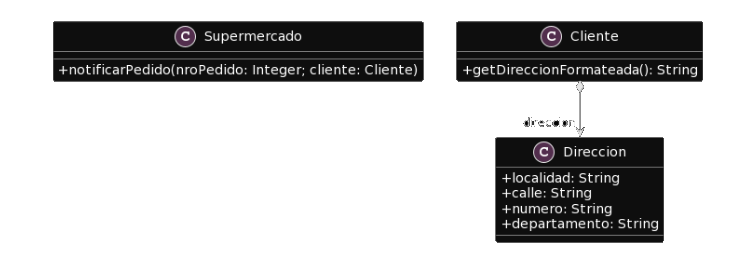

# 2.3 Publicacion
**Consigna:** Para el siguiente codigo, realice en forma iterativa los siguientes pasos:
1. indique el mal olor,
2. indique el refactoring que lo corrige, 
3. aplique el refactoring, mostrando el resultado final (código y/o diseño según corresponda). 

Si vuelve a encontrar un mal olor, retorne al paso 1.

**UML Proporcionado**



**Codigo Proporcionado**

```java
public class Supermercado {
    public void notificarPedido(long nroPedido, Cliente cliente) {
        String notificacion = MessageFormat.format(“Estimado cliente, se le informa que hemos recibido su pedido con número {0}, el cual será enviado a la dirección {1}”, new Object[] { nroPedido, cliente.getDireccionFormateada() });

        // lo imprimimos en pantalla, podría ser un mail, SMS, etc..
        System.out.println(notificacion);
    }
}

public class Cliente {
    public String getDireccionFormateada() {
        return 
            this.direccion.getLocalidad() + “, ” +
            this.direccion.getCalle() + “, ” +
            this.direccion.getNumero() + “, ” +
            this.direccion.getDepartamento()
            ;
    }
}
```
---
## Solucion:
<br>

**Code Smell:** Envidia de atributos, la clase cliente solicita demasiados datos de la clase Direccion.

**Refactoring:** Extract Method.

```java
public class Supermercado {
   public void notificarPedido(long nroPedido, Cliente cliente) {
     String notificacion = MessageFormat.format(“Estimado cliente, se le informa que hemos recibido su pedido con número {0}, el cual será enviado a la dirección {1}”, new Object[] { nroPedido, cliente.getDireccionFormateada() });

     // lo imprimimos en pantalla, podría ser un mail, SMS, etc..
    System.out.println(notificacion);
  }
}

public class Cliente {
    public getDireccionFormateada(){
        return this.direccion.getDireccionFormateada();
    }
}


public class Direccion {
    public String localidad;
    public String calle;
    public String numero;
    public String departamento;

    public String getDireccionFormateada() {
	    return 
            this.localidad() + “, ” +
            this.calle() + “, ” +
            this.numero() + “, ” +
            this.departamento();
    }
}
```

**Code Smell:** Falta de encapsulamiento en la clase Direccion.

**Refactoring:** Encapsulate fields.

```java
public class Supermercado {
   public void notificarPedido(long nroPedido, Cliente cliente) {
     String notificacion = MessageFormat.format(“Estimado cliente, se le informa que hemos recibido su pedido con número {0}, el cual será enviado a la dirección {1}”, new Object[] { nroPedido, cliente.getDireccionFormateada() });

     // lo imprimimos en pantalla, podría ser un mail, SMS, etc..
    System.out.println(notificacion);
  }
}

public class Cliente {
    public getDireccionFormateada(){
        return this.direccion.getDireccionFormateada();
    }
}


public class Direccion {
    private String localidad;
    private String calle;
    private String numero;
    private String departamento;

    public String getLocalidad(){ return this.localidad;}
    public void setLocalidad(String localidad){ this.localidad = localidad;}
    //...

    public String getDireccionFormateada() {
	    return 
            this.getLocalidad() + “, ” +
            this.getCalle() + “, ” +
            this.getNumero() + “, ” +
            this.getDepartamento();
    }
}
```